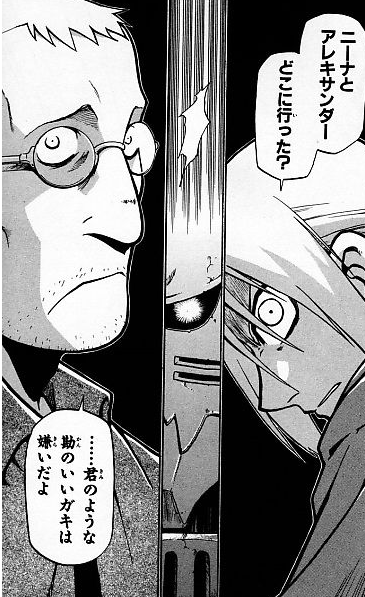

[뒤로](https://github.com/papamoomin/ForMiri/blob/master/contents/chap1.md#Chap1-2)  

```c++
#include<iostream>
int main()
{
    std::cout << "Hello";
	std::cout << "World!";
}
```

줄바꿈이 되어서 나올까요, 아니면 그렇지 않을까요?  
될 거라고 생각해서 오셨다면 무척 흡족하게 생각합니다.  
만약 안되니까 묻지 않았을까, 생각하신 분이 있으신가요?

<details markdown="1">
<summary>그렇다면.. [터치]</summary>
 <p align="center" style="font-size:20px"><br><b>너처럼 눈치빠른 꼬맹이는 싫..<br>
 은건 아니고 조금 김이 샘</b></p>  

넵. 이 코드의 실행 결과는
```C++
HelloWorld!
```
입니다.  

그럼 만약
```c++
#include<iostream>
int main()
{
    std::cout << "Hello
    World!";
}
```
라고 한다면요?  
애석하게도 이건 에러가 난답니다.. 줄바꿈은 이렇게 할 수 없다는 뜻이겠죠.  
그럼 어떻게 할 수 있을까요. 이건 되돌아가서 더 이야기해볼까요?
</details>

<br><br><br>
[뒤로](https://github.com/papamoomin/ForMiri/blob/master/contents/chap1.md#Chap1-2)  