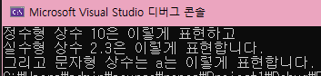

[뒤로](https://github.com/papamoomin/ForMiri/blob/master/README.md)  

<a name="Top"></a>
# 목차
[1. 상수와 상수의 출력](#Chap1)  
[2. 자료형](#Chap2)  
[- 숙제](#Chap3)  

<br><br><br>

[위로](#Top)
<a name="Chap1"></a>
# 1. 상수와 상수의 출력
<b>상수</b>란 무엇일까요? 두산백과에서 퍼온 말을 빌리자면 <b>변하지 않고 항상 같은 값을 가지는 수</b> 라고 하네요.  
컴퓨터는 메모리에 값을 저장해요. 어떤 값을 저장하냐에 따라 값을 저장할 공간의 알맞은 크기를 잡아둔 뒤, 그 공간에 값을 저장합니다.  
상수라는건 그 메모리에 잡힌 값이 변할 수 없도록 지정되어 있는 것이에요.  
그럼 상수란 어떻게 표현하는 것일까, 우리가 앞서 본 예제를 다시 볼까요?
```C++
#include<iostream>
int main()
{
	std::cout << "Hello, World!";
}
```
여기도 상수가 있습니다. 여기서 Hello, World! 는 <b>문자열 상수</b>에요.  
Hello, World!의 값은 변하지 않고, 변하게 만들 수도 없기 때문이죠.  
이 외에도 <b>문자형, 정수형, 실수형, 논리형 상수</b> 등이 존재합니다. 논리형은 뒤에서 다시 얘기하기로 할게요.  
그럼 문자형, 정수형, 실수형 상수는 어떻게 생겼을까요?  
예상하시겠지만 a, 2, 2.0003 같은 것들이 그에 해당해요.  
그럼 이런 문자, 정수, 실수형 상수는 어떻게 표현할 수 있을까, 묻는다면 답은 간단합니다.  

```C++
#include<iostream>
int main()
{
	std::cout << "정수형 상수 " << 10 << "은 이렇게 표현하고" << std::endl;
	std::cout << "실수형 상수 " << 2.3 << "은 이렇게 표현합니다." << std::endl;
	std::cout << "그리고 문자형 상수는 " << 'a' << "는 이렇게 표현합니다.";
}
```
<p align="center"></p>  

모든 상수와 뒤에 나올 변수라는 친구는 cout에서 이렇게 <b><<</b> 로 구분할 수 있습니다.  
그리고 예제를 보면 문자형, 정수형, 실수형 상수도 문자열 상수와 동일하게 취급하면 된다는 것을 확인할 수 있죠!  
여기서 알아두셔야할 점은 문자 하나짜리의 문자형 상수는 ' ' 로 감싸고, 문자열 상수는 " " 로 감쌉니다.  
문자열인데 ' ' 로 감싸면 에러가 남에 주의하세요!  


<br><br><br>

이제 조금 지루할 수 있는 내용임에 주의하세요..

[위로](#Top)
<a name="Chap2"></a>

# 2. 자료형

상수를 알았으니 변수를 알기에 앞서 자료형이라는 것을 알아보고자 해요.  
아까 위에서 컴퓨터는 메모리에 알맞은 크기의 공간을 잡아 저장한다고 했던 것 기억하시나요?  
컴퓨터가 어떤 값이 들어갈 지 알아서 다 구분을 해준다면 좋겠지만, 그렇지 못한 경우가 많아요. 그래서 자료형이라는 것이 탄생했습니다!  
<b>자료형이란 말 그대로 어떤 종류의 자료인지를 표현할 형태를 지정하는 키워드</b>에요.  
그럼 자료형을 찬찬히 보도록 할까요?  

## 정수형
- short (범위 : -32,768 ~ 32,767)
- unsigned short (범위 : 0 ~ 65,535)
- int (범위 : -2147483648 ~ 2,147,483,647)
- unsigned int (범위 : 0 ~ 4,294,967,295)
- long (범위 : -2147483648 ~ 2,147,483,647)
- unsigned long (범위 : 0 ~ 4,294,967,295)
- long long (범위 : -9,223,372,036,854,775,808 ~ 9,223,372,036,854,775,807)
- unsigned long long (범위 : 0 ~ 18,446,744,073,709,551,615)  

<b>보통은 int를 사용</b>하고, 더 큰 범위가 필요할 때에는 long long을 사용합니다.  
지금은 그냥 이렇게 다양하게 있다, <b>short -> long long으로 갈수록 값의 범위가 커진다</b> 정도만 기억해주세요! 다만 <b>메모리도 더 많이 차지</b>하게 됩니다.  
그리고 unsigned라는게 보이죠?  
이건 원래 -xx ~ 0 까지의 수를 +쪽으로 당긴거라 보시면 되어요!  
음수가 필요하지 않은 경우일 때 유용하게 사용됩니다.  

<br><br>

## 실수형
- float (범위 : 3.4E +- 38) -> 대강 소수점 7자리
- double (범위 : 1.7E +- 308) -> 대강 소수점 15자리  

이 경우에도 그냥 <b>소수점 7자리까지 가능하면 float, 그보다 더 필요하면 double</b>을 씁니다.  
다만 double이 메모리는 더 차지해도 좀 더 정확한 편이어서 그냥 double을 쓰기도 해요!  

<br><br>

## 문자형
- char (범위 : -128 ~ 127)  
- unsigned char (범위 : 0 ~ 255)  

아스키코드라는 말 들어보셨나요?  
우리가 쓰는 문자는 기본적으로 아스키코드라는 값으로 구성되어있고 이는 숫자로 표현됩니다.  
문자형인데 범위가 -128~127인 이유가 그거에요!  
대표적으로 'a' 는 아스키코드로 64랍니다. 'b'는 65, 'c'는 66... 이런 식이에요!  
그냥 <b>아, 문자 하나하나는 특정 숫자값이 대응되는구나. 그리고 문자 하나를 표현할 때 상수로는 외따옴표를 이용하고 자료형은 char구나</b>, 정도로만 알아두시어요!

<br><br>

## 논리형
- bool (범위 : 0 ~ 1)

자, 드디어 대망의 논리형입니다.  
고작 0과 1이지만 논리형이 없으면 사실 그 어떤 프로그램도 만들 수 없어요!  
<b>0은 false, 1은 true. 즉, 논리형은 참과 거짓을 표현하는 자료형</b>이랍니다! 앞으로 나올 조건문이라는 것을 이용해 이 조건이 참일 때는 이걸, 거짓일 때는 이걸 수행하라! 같은 용도로 사용하는 친구에요.  

<br><br><br><br><br>


우리는 시험을 보는 것이 아니니까 범위나 그런 것까지 세세하게 외울 필요는 없습니다.  
저도 그냥 short는 2^15제곱, int는 대강 21억 정도로만 기억하고 세세하게 필요한 일이 생기면 그 때 검색해보는 편이에요!  

<br>

자료형은 다음에 배울 '변수'를 포함해 필수적으로 필요한 친구랍니다.  
그냥 이런게 있다, 정도만 생각해두시어요.  
어차피 외우려 하지 않으셔도 앞으로 뒤의 내용을 공부하다보면 저절로 외워질 친구들이니까요!

<br><br><br>

[위로](#Top)
<a name="Chap3"></a>
# 숙제!

1. 문자형, 문자열, 정수형, 실수형 상수를 모두 사용해 cout 하나로 출력하는 코드를 짜주세요. 결과가 어떻게 나올지도 함께 적어주세요. 내용은 어떤 것이든 상관 없습니다!